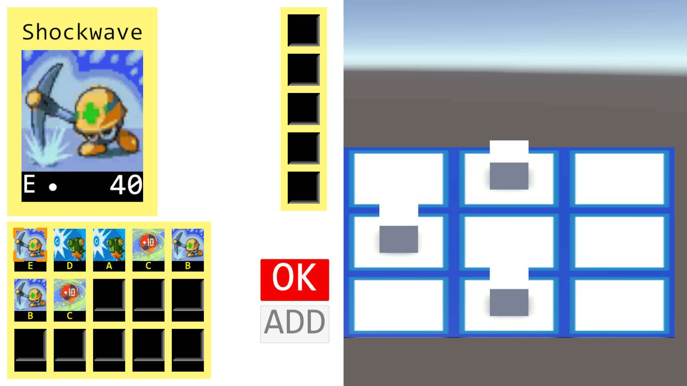
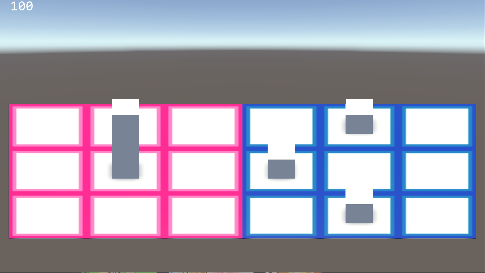

# Mega Man Battle Network 7
    Better name to come, one that makes it very obvious this is a fangame and I'm not trying to steal Capcom IP
## Concept
I wanted to make a sequel game that combined all of my/the community's favourite aspects of all the games, combined with a more modern approach to game development. Exactly what that means is right now is a bit vague, but I'm working on it. The main thing I want to do is move away from the very linear storyline and provide the player with more freedom of choice, like a character creator that lets you play someone other than Lan Hikari and Mega Man, and dialog options that impact the story, all while remaining open source so that anyone can suggest/add features they'd like to see.
## Sample gameplay images
    Stolen image assets are just used for testing purposes, will replace with my own images
### Chip screen

### Battle screen

